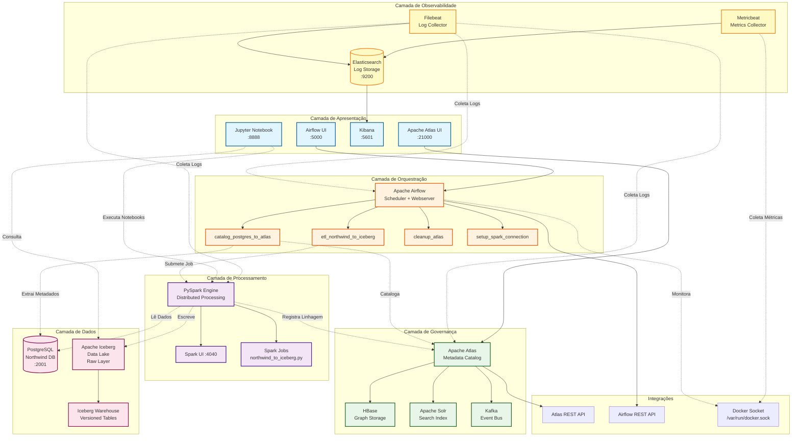

# Apache Atlas DataOps Lab

> **Laboratório completo para aprendizado de catalogação de dados com Apache Atlas, PostgreSQL e Python**

## Sobre o Projeto

Este repositório fornece um ambiente completo de aprendizado para **Data Governance** e **DataOps** usando Apache Atlas como catálogo de dados. O projeto demonstra desde conceitos básicos até implementações avançadas de descoberta automática de metadados, linhagem de dados e integração com bancos relacionais.

### Objetivos de Aprendizado

- **Catalogação de Dados**: Criar e gerenciar catálogos de metadados
- **API Integration**: Integrar sistemas via REST APIs do Apache Atlas
- **Data Lineage**: Mapear origem e transformações de dados
- **Metadata Management**: Extrair e organizar metadados estruturais
- **DataOps Practices**: Automatizar descoberta e catalogação

## Arquitetura do Sistema

### Diagrama de Arquitetura



### Stack Tecnológica

| Componente | Tecnologia | Versão | Porta | Função |
|------------|------------|--------|-------|--------|
| **Catálogo** | Apache Atlas | 2.3.0 | 21000 | Governança e metadados |
| **Database** | PostgreSQL | 14.19 | 2001 | Dados de exemplo (Northwind) |
| **Orquestração** | Apache Airflow | 3.0.0 | 5000 | Workflows e ETL |
| **Analytics** | PySpark + Jupyter | Latest | 8888 | Análise e notebooks |
| **Data Lake** | Apache Iceberg | 1.4.3 | - | Armazenamento com versionamento |
| **Monitoring** | Elasticsearch | 8.11.0 | 9200 | Armazenamento de logs |
| **Visualization** | Kibana | 8.11.0 | 5601 | Dashboards e análise |
| **Log Shipping** | Filebeat | 8.11.0 | - | Coleta de logs |
| **Metrics** | Metricbeat | 8.11.0 | - | Coleta de métricas |
| **Storage** | HBase (embedded) | - | - | Persistência Atlas |
| **Search** | Apache Solr (embedded) | - | - | Indexação e busca |
| **Messaging** | Apache Kafka (embedded) | - | - | Eventos e notificações |

### Fluxos de Dados Principais

#### 1. **Catalogação de Metadados (DAG: catalog_postgres_to_atlas)**
```
PostgreSQL → Airflow → Extração de Schema → Apache Atlas → Catálogo Centralizado
```
- Extrai estrutura de tabelas, colunas e relacionamentos
- Registra metadados no Atlas via REST API
- Execução diária automatizada

#### 2. **Pipeline ETL com Linhagem (DAG: etl_northwind_to_iceberg)**
```
PostgreSQL → Spark Job → Transformação → Iceberg Tables → Atlas (Linhagem)
```
- Lê dados do Northwind
- Processa com PySpark
- Armazena em formato Iceberg
- Registra linhagem completa no Atlas
- Aplica tags de qualidade automaticamente

#### 3. **Observabilidade e Monitoramento**
```
Containers → Filebeat/Metricbeat → Elasticsearch → Kibana Dashboards
```
- Coleta logs de todos os serviços
- Coleta métricas de containers (CPU, memória, rede)
- Visualização em tempo real
- Alertas configuráveis

## Estrutura do Repositório

```
atlas-dataops-lab/
├── docker-compose.yml          # Orquestração dos serviços
├── Dockerfile                  # Atlas customizado
├── Dockerfile_Spark           # PySpark + Jupyter + Iceberg
├── Dockerfile_AirFlow         # Apache Airflow
├── wait-for-atlas.sh          # Script de inicialização
├── users-credentials.properties # Autenticação Atlas
├── requirements.txt           # Dependências globais
├── airflow_connections.py     # Configuração de conexões
├── spark_remote_submit.py     # Wrapper Spark remoto
├── .env                       # Variáveis de ambiente
├── LICENSE                    # Licença do projeto
├── README.md                  # Este arquivo
├── .gitignore                # Arquivos ignorados
│
├── dags/                      # DAGs do Airflow
│   ├── __init__.py
│   ├── catalog_postgres_to_atlas.py # DAG de catalogação PostgreSQL
│   ├── cleanup_atlas.py       # DAG de limpeza do Atlas
│   ├── etl_northwind_to_iceberg.py # DAG ETL Spark + Iceberg
│   └── setup_spark_connection.py # DAG setup conexão Spark
│
├── spark_jobs/                # Jobs Spark
│   └── northwind_to_iceberg.py # ETL Northwind -> Iceberg
│
├── logs/                      # Logs do Airflow
│   ├── dag_processor/         # Logs de processamento
│   └── .gitkeep              # Mantém diretório no Git
│
├── plugins/                   # Plugins customizados do Airflow
│   └── __init__.py
│
├── data/                      # Datasets para análise
├── db/
│   └── northwind.sql          # Schema e dados PostgreSQL
│
├── Exercicios/
│   └── EXERCICIO_ATLAS.md     # Exercício prático completo
│
├── lab/
│   ├── atlas_client.py        # Cliente Python para Atlas API
│   ├── config.py              # Configurações do laboratório
│   ├── data_discovery.py      # Descoberta de dados
│   ├── lineage_demo.py        # Demonstração de linhagem
│   ├── postgres_integration.py # Integração PostgreSQL
│   ├── LAB_ATLAS_PYTHON.md    # Guia do laboratório Python
│   ├── requirements.txt       # Dependências Python
│   └── run_lab.sh            # Script de execução
│
├── notebooks/
│   ├── Lab_Catalogo_Postgres_no_Atlas.ipynb
│   ├── Iceberg_Demo.ipynb     # Demo Apache Iceberg
│   └── data/                  # Dados para notebooks
│
└── respostas/
    ├── config_exercicio.py    # Configurações do exercício
    ├── requirements_exercicio.txt # Dependências do exercício
    └── SOLUCAO_EXERCICIO.py   # Solução completa
```

## Início Rápido

### 1. Pré-requisitos

- **Docker** >= 20.10
- **Docker Compose** >= 2.0
- **Python** >= 3.8 (opcional, para desenvolvimento local)
- **8GB RAM** disponível (recomendado)

### 2. Inicialização

```bash
# Clonar o repositório
git clone https://github.com/AleTavares/atlas-dataops-lab.git
cd atlas-dataops-lab

# Iniciar todos os serviços
docker-compose up --build -d

# Aguardar inicialização (5-10 minutos)
./wait-for-atlas.sh

# Verificar status dos serviços
docker-compose ps
```

### 3. Acesso aos Serviços

| Serviço | URL | Credenciais |
|---------|-----|-------------|
| **Apache Atlas** | http://localhost:21000 | admin / admin |
| **Apache Airflow** | http://localhost:5000 | admin / admin |
| **Kibana** | http://localhost:5601 | - |
| **Elasticsearch** | http://localhost:9200 | - |
| **Jupyter Notebook** | http://localhost:8888 | Token: tavares1234 |
| **PostgreSQL** | localhost:2001 | postgres / postgres |

## Laboratórios Disponíveis

### Lab 1: Cliente Atlas Básico
```bash
cd lab
pip install -r requirements.txt
python atlas_client.py
```
**Aprenda**: Conexão com Atlas, busca de entidades, API REST

### Lab 2: Jupyter Notebook Interativo
```bash
# Acessar: http://localhost:8888 (token: tavares1234)
# Abrir: Lab_Catalogo_Postgres_no_Atlas.ipynb
```
**Aprenda**: Extração de metadados, catalogação automática, visualização

### Lab 3: Airflow - Catalogação Automática
```bash
# Acessar: http://localhost:5000 (admin/admin)
# Executar DAG: catalog_postgres_to_atlas
```
**Aprenda**: Orquestração de workflows de catalogação

### Lab 3.1: Airflow - Limpeza do Atlas
```bash
# Acessar: http://localhost:5000 (admin/admin)
# Executar DAG: cleanup_atlas (execução manual)
```
**Aprenda**: Manutenção e limpeza de metadados

### Lab 4: Spark + Iceberg - ETL Completo
```bash
# Acessar: http://localhost:5000 (admin/admin)
# Executar DAG: etl_northwind_to_iceberg
```
**Aprenda**: ETL com Spark, Iceberg, linhagem e tags de qualidade

### Lab 5: Iceberg Demo Interativo
```bash
# Acessar: http://localhost:8888 (token: tavares1234)
# Abrir: Iceberg_Demo.ipynb
```
**Aprenda**: Apache Iceberg, time travel, versionamento

### Lab 6: Exercício Prático Completo
```bash
# Seguir instruções em EXERCICIO_ATLAS.md
```
**Aprenda**: Implementação completa de catalogador de dados

## Configurações Detalhadas

### Apache Atlas
- **Modo**: Standalone com componentes embedded
- **Storage**: BerkeleyDB para grafos, HBase para metadados
- **Search**: Apache Solr embedded
- **Messaging**: Kafka embedded para eventos
- **Autenticação**: File-based (users-credentials.properties)
- **Memória**: 1.5GB heap, 768MB inicial
- **Persistência**: Volume Docker `atlas_data`
- **Healthcheck**: Verificação a cada 30s com 180s de startup
- **Limites**: 3GB RAM máxima, 65536 file descriptors

### PostgreSQL Northwind
- **Database**: northwind (carregado automaticamente)
- **Tabelas**: 14 tabelas relacionais completas
  - `customers`, `products`, `orders`, `order_details`
  - `employees`, `categories`, `suppliers`, `shippers`
  - `territories`, `region`, `employee_territories`
  - `customer_demographics`, `customer_customer_demo`
- **Dados**: ~3000 registros com relacionamentos
- **Persistência**: Volume Docker `postgres_data`
- **Encoding**: UTF8 com collation C

### PySpark + Jupyter
- **Base Image**: jupyter/pyspark-notebook:latest
- **Packages**: requests, psycopg2-binary, pandas, matplotlib, seaborn, pyiceberg
- **Volumes**: notebooks/, data/, spark_jobs/ e iceberg_warehouse/ mapeados
- **Spark UI**: http://localhost:4040 (quando jobs estão rodando)
- **Memória**: 4GB driver, 4GB executor
- **Iceberg**: Suporte completo para Apache Iceberg 1.4.3

### Apache Airflow
- **Modo**: Standalone (scheduler + webserver + executor)
- **Backend**: PostgreSQL (compartilhado com Northwind)
- **Executor**: Local Executor
- **Autenticação**: Basic Auth (admin/admin)
- **Volumes**: dags/, logs/, plugins/, spark_jobs/ mapeados
- **Docker Socket**: Acesso para submissão remota de jobs Spark
- **Healthcheck**: Verificação a cada 30s

### Elastic Stack
- **Elasticsearch**: Single-node, sem segurança, 512MB heap
- **Kibana**: Conectado ao Elasticsearch, dashboards pré-configurados
- **Filebeat**: Coleta logs do Airflow e containers Docker
- **Metricbeat**: Coleta métricas de CPU, memória, rede e disco dos containers
- **Persistência**: Volume Docker `elasticsearch_data`

### Rede
- **Nome**: plataform-network
- **Subnet**: 172.16.240.0/24
- **Driver**: Bridge (padrão)
- **Comunicação**: Todos os containers na mesma rede

## DAGs Disponíveis

### 1. **catalog_postgres_to_atlas**
- **Descrição**: Catalogação automática do PostgreSQL Northwind no Atlas
- **Schedule**: Diário (`@daily`)
- **Tasks**: 
  - `extract_metadata` - Extrai metadados do PostgreSQL
  - `create_database` - Cria database no Atlas
  - `catalog_tables` - Cataloga estrutura das tabelas
  - `catalog_columns` - Cataloga colunas das tabelas
- **Execução**: Automática ou manual

### 2. **cleanup_atlas**
- **Descrição**: Limpeza completa de todas as entidades do Atlas
- **Schedule**: Manual apenas
- **Tasks**:
  - `get_all_entities` - Lista todas as entidades
  - `delete_columns` - Remove todas as colunas
  - `delete_tables` - Remove todas as tabelas
  - `delete_databases` - Remove todos os databases
  - `cleanup_remaining` - Limpa entidades restantes
- **⚠️ ATENÇÃO**: Remove TODAS as entidades do Atlas

### 3. **etl_northwind_to_iceberg**
- **Descrição**: ETL completo Northwind PostgreSQL para Iceberg Raw Layer
- **Schedule**: Semanal (`@weekly`)
- **Tasks**:
  - `check_spark_job` - Verifica existência do job Spark
  - `submit_spark_job` - Executa job Spark no container pyspark-aula
  - `validate_results` - Valida tabelas criadas via Atlas API
- **Funcionalidades**: Extração, catalogação, linhagem, tags de qualidade

### 4. **setup_spark_connection**
- **Descrição**: Configuração da conexão Spark no Airflow
- **Schedule**: Manual apenas
- **Tasks**:
  - `create_spark_connection` - Cria conexão spark_container
- **Uso**: Executar uma vez para configurar ambiente

## Comandos Úteis

### Gerenciamento de Serviços
```bash
# Ver logs específicos
docker-compose logs -f atlas
docker-compose logs -f postgres_erp
docker-compose logs -f airflow-standalone
docker-compose logs -f pyspark-aula

# Reiniciar serviço específico
docker-compose restart atlas

# Parar todos os serviços
docker-compose down

# Limpar volumes (CUIDADO: perde dados)
docker-compose down -v

# Rebuild completo
docker-compose up --build --force-recreate

# Verificar status de todos os serviços
docker-compose ps

# Verificar saúde dos containers
docker-compose ps --format json | jq '.[] | {name: .Name, status: .Status, health: .Health}'
```

### Airflow - Gerenciamento de DAGs
```bash
# Listar DAGs
docker exec -it airflow-standalone airflow dags list

# Executar DAG manualmente
docker exec -it airflow-standalone airflow dags trigger catalog_postgres_to_atlas
docker exec -it airflow-standalone airflow dags trigger etl_northwind_to_iceberg

# Ver status de execução
docker exec -it airflow-standalone airflow dags state catalog_postgres_to_atlas

# Pausar/Despausar DAG
docker exec -it airflow-standalone airflow dags pause catalog_postgres_to_atlas
docker exec -it airflow-standalone airflow dags unpause catalog_postgres_to_atlas

# Ver logs de uma task específica
docker exec -it airflow-standalone airflow tasks logs catalog_postgres_to_atlas extract_metadata 2025-01-01
```

### Spark - Gerenciamento de Jobs
```bash
# Acessar container Spark
docker exec -it pyspark_aula_container bash

# Submeter job Spark manualmente
docker exec -it pyspark_aula_container spark-submit \
  --master local[*] \
  /home/jovyan/work/spark_jobs/northwind_to_iceberg.py

# Ver jobs Spark em execução
curl http://localhost:4040/api/v1/applications

# Listar tabelas Iceberg criadas
docker exec -it pyspark_aula_container ls -la /home/jovyan/iceberg-warehouse/
```

### Atlas - Gerenciamento de Metadados
```bash
# Testar conectividade Atlas
curl -u admin:admin http://localhost:21000/api/atlas/admin/version

# Listar tipos de entidades
curl -u admin:admin http://localhost:21000/api/atlas/v2/types/typedefs

# Buscar entidades por tipo
curl -u admin:admin "http://localhost:21000/api/atlas/v2/search/basic?typeName=rdbms_table"

# Contar entidades
curl -u admin:admin "http://localhost:21000/api/atlas/v2/search/basic?typeName=rdbms_table&limit=0" | jq '.approximateCount'

# Limpar todas as entidades (usar com cuidado!)
./reset-atlas.sh
```

### PostgreSQL - Consultas
```bash
# Testar PostgreSQL
docker exec -it postgres-erp psql -U postgres -d northwind -c "SELECT count(*) FROM customers;"

# Listar todas as tabelas
docker exec -it postgres-erp psql -U postgres -d northwind -c "\dt"

# Acessar console interativo
docker exec -it postgres-erp psql -U postgres -d northwind

# Backup do banco
docker exec -it postgres-erp pg_dump -U postgres northwind > northwind_backup.sql
```

### Monitoring - Elastic Stack
```bash
# Verificar saúde do Elasticsearch
curl http://localhost:9200/_cluster/health?pretty

# Listar índices
curl http://localhost:9200/_cat/indices?v

# Contar documentos em índice
curl http://localhost:9200/metricbeat-*/_count

# Testar Filebeat
docker exec filebeat filebeat test config
docker exec filebeat filebeat test output

# Testar Metricbeat
docker exec metricbeat metricbeat test config
docker exec metricbeat metricbeat test output

# Configurar dashboards
./monitoring/setup_dashboards.sh
```

### Diagnóstico e Performance
```bash
# Verificar recursos de todos os containers
docker stats

# Verificar uso de disco
df -h
docker system df

# Limpar recursos não utilizados
docker system prune -a --volumes

# Verificar logs de erro em todos os serviços
docker-compose logs | grep -i error

# Monitorar logs em tempo real
docker-compose logs -f --tail=100
```

## Casos de Uso Educacionais

### 1. **Data Discovery & Cataloging**
- ✅ Descoberta automática de esquemas de banco de dados
- ✅ Catalogação de tabelas, colunas e relacionamentos
- ✅ Busca e navegação no catálogo centralizado
- ✅ Extração de metadados via JDBC
- **Lab**: `catalog_postgres_to_atlas` DAG

### 2. **Metadata Management**
- ✅ Extração de metadados estruturais e técnicos
- ✅ Criação de entidades customizadas no Atlas
- ✅ Relacionamentos entre entidades (foreign keys)
- ✅ Classificação e tagging automatizado
- **Lab**: `Lab_Catalogo_Postgres_no_Atlas.ipynb`

### 3. **Data Lineage & Provenance**
- ✅ Mapeamento completo de origem dos dados
- ✅ Rastreamento de transformações ETL
- ✅ Visualização gráfica de fluxos de dados
- ✅ Linhagem automática via Spark
- ✅ Processos de ETL registrados no Atlas
- **Lab**: `etl_northwind_to_iceberg` DAG

### 4. **API Integration & Automation**
- ✅ Uso de REST APIs do Apache Atlas
- ✅ Autenticação e autorização
- ✅ Operações CRUD em metadados
- ✅ Integração com Python (requests)
- **Lab**: `lab/atlas_client.py`

### 5. **DataOps & Orchestration**
- ✅ Workflows automatizados com Airflow
- ✅ Pipelines de catalogação contínua
- ✅ Integração com ferramentas de CI/CD
- ✅ Monitoramento de qualidade de dados
- ✅ Tags de qualidade automatizadas
- **Lab**: Todos os DAGs do Airflow

### 6. **Data Lake & Versioning**
- ✅ Armazenamento em formato Apache Iceberg
- ✅ Versionamento de dados (time travel)
- ✅ Schema evolution
- ✅ ACID transactions
- **Lab**: `Iceberg_Demo.ipynb`

### 7. **Observability & Monitoring**
- ✅ Coleta de logs centralizada
- ✅ Métricas de containers em tempo real
- ✅ Dashboards de saúde da plataforma
- ✅ Alertas configuráveis
- **Lab**: Kibana Dashboards (`monitoring/`)

## Próximos Passos - Roadmap

### Evolução para Plataforma DataOps Completa

Os próximos desenvolvimentos deste repositório incluirão a implementação de uma **plataforma DataOps completa** com orquestração avançada e linhagem automática de dados:

#### **Apache Airflow - Orquestração de ETLs**
- **Scheduler Avançado**: Orquestração de pipelines de dados complexos
- **DAGs Automatizados**: Workflows para descoberta e catalogação contínua
- **Monitoramento**: Interface web para acompanhamento de execuções
- **Integração Atlas**: DAGs específicos para sincronização de metadados

#### **Apache Spark - Engine de Transformação**
- **Processamento Distribuído**: Transformações em larga escala
- **Conectores Nativos**: Integração direta com PostgreSQL e Atlas
- **Spark Streaming**: Processamento de dados em tempo real
- **Delta Lake**: Versionamento e qualidade de dados

#### **Linhagem Automática de Dados**
- **Rastreamento Completo**: Origem → Transformação → Destino
- **Spark Lineage**: Captura automática via Spark Listener
- **Atlas Integration**: Registro automático de processos ETL
- **Visualização Gráfica**: Mapeamento visual de fluxos de dados

### **Arquitetura Futura**

### **Funcionalidades Implementadas e Planejadas**

| Componente | Funcionalidade | Status | Detalhes |
|------------|----------------|--------|----------|
| **Airflow** | DAGs de catalogação automática | ✅ **Implementado** | 4 DAGs operacionais |
| **Airflow** | DAG de limpeza do Atlas | ✅ **Implementado** | Manutenção completa |
| **Airflow** | DAG ETL Spark + Iceberg | ✅ **Implementado** | Pipeline completo |
| **Airflow** | Submissão remota de Spark Jobs | ✅ **Implementado** | Via Docker socket |
| **Atlas** | Catalogação via API REST | ✅ **Implementado** | CRUD completo |
| **Atlas** | Linhagem automática de dados | ✅ **Implementado** | End-to-end lineage |
| **Atlas** | Tags de qualidade automatizadas | ✅ **Implementado** | Quality tags |
| **Atlas** | Tipos customizados (rdbms_*) | ✅ **Implementado** | Database, Table, Column |
| **PostgreSQL** | Extração de metadados Northwind | ✅ **Implementado** | 14 tabelas |
| **Spark** | Jobs ETL com Iceberg | ✅ **Implementado** | Distributed processing |
| **Spark** | Integração com Atlas | ✅ **Implementado** | Metadata registration |
| **Iceberg** | Armazenamento com versionamento | ✅ **Implementado** | Time travel |
| **Iceberg** | Schema evolution | ✅ **Implementado** | Dynamic schemas |
| **Monitoring** | Elasticsearch + Kibana | ✅ **Implementado** | Logs centralizados |
| **Monitoring** | Filebeat (Log shipping) | ✅ **Implementado** | Airflow + Docker logs |
| **Monitoring** | Metricbeat (Metrics) | ✅ **Implementado** | Container metrics |
| **Monitoring** | Dashboards pré-configurados | ✅ **Implementado** | Health dashboards |
| **Jupyter** | Notebooks interativos | ✅ **Implementado** | 2 labs completos |
| **Governance** | Políticas avançadas | 📋 **Planejado** | Access control |
| **Governance** | Data Quality Rules | 📋 **Planejado** | Automated validation |
| **Integration** | Conectores adicionais | 📋 **Planejado** | MySQL, MongoDB, S3 |

### **Benefícios da Evolução**

- **Automação Completa**: Descoberta e catalogação sem intervenção manual
- **Linhagem End-to-End**: Rastreamento completo do ciclo de vida dos dados
- **Escalabilidade**: Processamento distribuído para grandes volumes
- **Governança Avançada**: Políticas e qualidade automatizadas
- **Observabilidade**: Monitoramento completo de pipelines

### **Como Contribuir**

Interessado em contribuir com essas funcionalidades? Áreas de desenvolvimento:

- **Airflow DAGs**: Desenvolvimento de workflows de catalogação
- **Spark Jobs**: Implementação de ETLs com captura de linhagem
- **Atlas Hooks**: Conectores customizados para diferentes fontes
- **Monitoring**: Dashboards e alertas de qualidade
- **Documentation**: Tutoriais e guias avançados

## Contribuição

Este é um projeto educacional open-source. Contribuições são muito bem-vindas!

### Como Contribuir

1. **Fork** o repositório
2. **Clone** seu fork localmente
   ```bash
   git clone https://github.com/seu-usuario/atlas-dataops-lab.git
   ```
3. **Crie** uma branch para sua feature
   ```bash
   git checkout -b feature/minha-feature
   ```
4. **Commit** suas mudanças
   ```bash
   git commit -m "feat: adiciona nova funcionalidade X"
   ```
5. **Push** para a branch
   ```bash
   git push origin feature/minha-feature
   ```
6. **Abra** um Pull Request no GitHub

### Áreas de Contribuição

#### Conectores de Dados
- [ ] Conector para MySQL
- [ ] Conector para MongoDB
- [ ] Conector para AWS S3
- [ ] Conector para Azure Data Lake
- [ ] Conector para Google BigQuery

#### Inteligência e Automação
- [ ] Classificação automática de dados sensíveis (PII)
- [ ] Detecção de anomalias em metadados
- [ ] Sugestões de relacionamentos baseadas em ML
- [ ] Análise de qualidade de dados automatizada

#### Visualização e BI
- [ ] Integração com Apache Superset
- [ ] Integração com Metabase
- [ ] Dashboards customizados no Kibana
- [ ] Relatórios de governança automatizados

#### Testes e Qualidade
- [ ] Testes unitários para DAGs
- [ ] Testes de integração
- [ ] Testes de performance
- [ ] CI/CD com GitHub Actions

#### Documentação
- [ ] Tutoriais em vídeo
- [ ] Guias avançados
- [ ] Traduções (EN, ES)
- [ ] Exemplos de casos de uso reais

#### Segurança e Governança
- [ ] Autenticação LDAP/AD
- [ ] Controle de acesso granular
- [ ] Auditoria de operações
- [ ] Criptografia de dados sensíveis

### Diretrizes de Código

- Siga o estilo PEP 8 para Python
- Adicione docstrings em funções e classes
- Inclua testes para novas funcionalidades
- Atualize a documentação relevante
- Use commits semânticos (feat, fix, docs, etc.)

### Reportar Bugs

Encontrou um bug? Abra uma issue com:
- Descrição clara do problema
- Passos para reproduzir
- Comportamento esperado vs atual
- Logs relevantes
- Versão do Docker e sistema operacional

## Licença

Este projeto está sob a licença MIT. Veja o arquivo [LICENSE](LICENSE) para detalhes.

## Estatísticas do Projeto

- **Containers**: 8 serviços orquestrados
- **DAGs**: 4 workflows automatizados
- **Notebooks**: 2 laboratórios interativos
- **Tabelas**: 14 tabelas Northwind catalogadas
- **Metadados**: ~200 entidades no Atlas
- **Linhagem**: Pipeline completo PostgreSQL → Iceberg
- **Monitoramento**: Logs e métricas em tempo real

## Suporte e Comunidade

- **Issues**: [GitHub Issues](https://github.com/AleTavares/atlas-dataops-lab/issues)
- **Discussions**: [GitHub Discussions](https://github.com/AleTavares/atlas-dataops-lab/discussions)
- **Email**: Abra uma issue para contato

## Agradecimentos

- **Apache Atlas Community** - Pela excelente ferramenta de governança de dados
- **Apache Airflow** - Pela plataforma de orquestração robusta
- **Apache Spark** - Pelo engine de processamento distribuído
- **Apache Iceberg** - Pelo formato de tabela com versionamento
- **Elastic Stack** - Pela stack completa de observabilidade
- **Northwind Database** - Pelo dataset educacional clássico
- **Docker Community** - Pela containerização simplificada
- **Jupyter Project** - Pelo ambiente interativo de análise

## Citação

Se você usar este projeto em pesquisa ou ensino, por favor cite:

```bibtex
@software{atlas_dataops_lab,
  author = {Alexandre Tavares},
  title = {Apache Atlas DataOps Lab},
  year = {2025},
  url = {https://github.com/AleTavares/atlas-dataops-lab},
  description = {Plataforma completa de aprendizado para Data Governance e DataOps}
}
```

**Para começar, acesse os laboratórios em ordem:**
1. [Lab Python Básico](lab/LAB_ATLAS_PYTHON.md)
2. [Exercício Prático](Exercicios/EXERCICIO_ATLAS.md)
3. [Notebook Interativo](notebooks/Lab_Catalogo_Postgres_no_Atlas.ipynb)